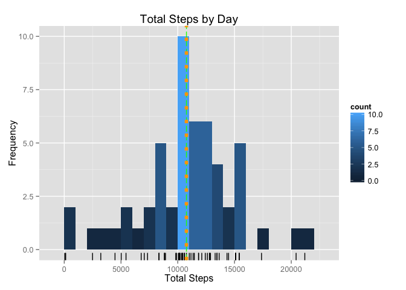
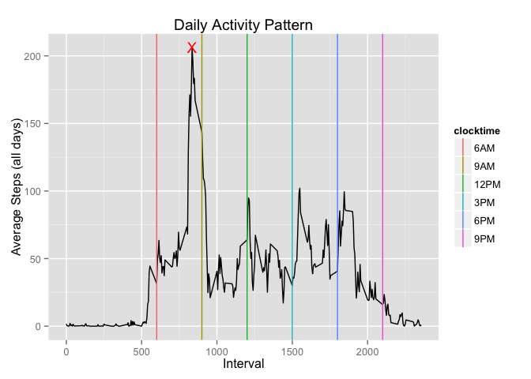
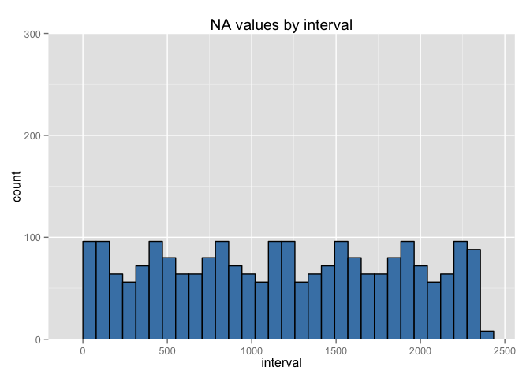
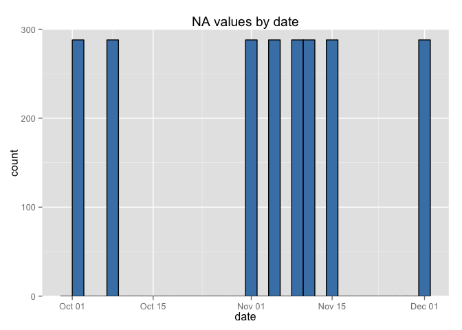
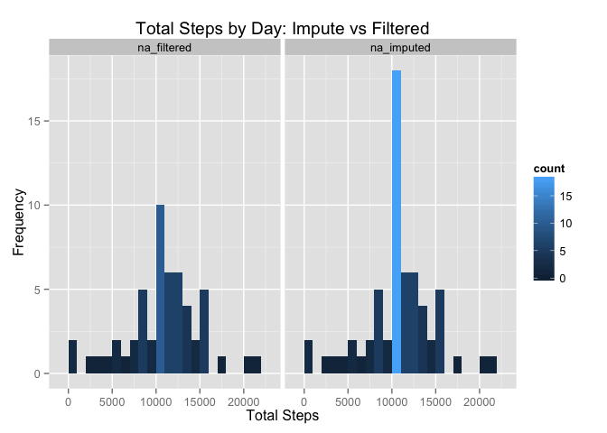
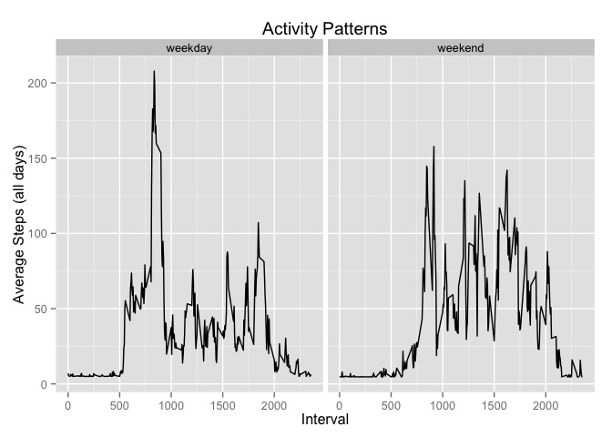

# Reproducible Research: Peer Assessment 1


## Loading and preprocessing the data

The data set is already neatly formatted, the only processing we will do is convert the date column
into a proper `Date` object.


```r
    if (!file.exists("activity.csv")) {
        unzip("activity.zip")
    }
    activity <- read.csv("activity.csv", colClasses = c("integer", "character", "integer"))
    activity$date <- as.Date(activity$date, "%Y-%m-%d")
```

## What is mean total number of steps taken per day?

#### Calculate the daily totals

Calculation of the daily sums is as simple as aggregating the steps by date. Also compute the median
and the average here.


```r
    library(plyr)

    dailysteps <- aggregate(steps ~ date, data = activity, FUN = sum, na.action = na.omit)
    names(dailysteps) <- c("date", "total_steps")

    dailysteps.mean <- mean(dailysteps$total_steps)
    dailysteps.median <- median(dailysteps$total_steps)
```

#### Create a histogram plot of the totals

We'll use color to highlight concentration rather than overlay a density curve.


```r
    library(ggplot2)

    ggplot(dailysteps, aes(x = total_steps)) + 
        geom_histogram(binwidth = 1000, aes(fill = ..count..)) + 
        geom_rug() + 
        ggtitle("Total Steps by Day") + 
        xlab("Total Steps") + 
        ylab("Frequency") +
        geom_vline(xintercept = dailysteps.median, color = "green", linetype = "longdash") +
        geom_vline(xintercept = dailysteps.median, color = "orange", linetype = "dotted", size = 2)
```



```r
    print(data.frame(calculation = c("Mean", "Median"), 
                     value = c(dailysteps.mean, dailysteps.median)))
```

```
##   calculation    value
## 1        Mean 10766.19
## 2      Median 10765.00
```

## What is the average daily activity pattern?

First we need to know the average of each 5-minute period in the data set averaged across all days.


```r
    ## for the moment at least continue ignoring NA values
    intervalsteps <- aggregate(steps ~ interval, data = activity, FUN = mean, na.action = na.omit)
    names(intervalsteps) <- c("interval", "mean_steps")

    # also calculate the max of all intervales
    intervalsteps.max <- intervalsteps[with(intervalsteps, mean_steps == max(mean_steps)), ]
```

Plot the mean steps x interval to see the average daily activity pattern for the set. Add in some
marker lines to show main points in the day.


```r
    # odd factor creation is to ensure the ordering in the legend follows the clocktime order
    # and not the 'natural' ordering of the strings.
    times <- data.frame(clocktime = factor(c("1", "2", "3", "4", "5", "6"), 
                                           labels = c("6AM", "9AM", "12PM", "3PM", "6PM", "9PM")),
                        interval = c(600, 900, 1200, 1500, 1800, 2100))

    ggplot(intervalsteps, aes(x = interval, y = mean_steps)) + 
            geom_line() +
            ggtitle("Daily Activity Pattern") +
            xlab("Interval") +
            ylab("Average Steps (all days)") +
            geom_vline(data = times, 
                       aes(xintercept = interval, color = clocktime), 
                       show_guide = TRUE) +
            geom_point(data = intervalsteps.max, aes(x = interval, y = mean_steps), 
                       color = "red", shape = "X", size = 5)
```



```r
    print(intervalsteps.max)
```

```
##     interval mean_steps
## 104      835   206.1698
```

## Imputing missing values

#### NA Density

There can only be NA values in the `steps` column since the other columns are fixed identifiers and
not measurements.


```r
    # Find all the missing values
    activity.nas <- activity[is.na(activity$steps),]
    natotal <- nrow(activity.nas)

    print(paste("Total number of NAs in the dataset:", natotal))
```

```
## [1] "Total number of NAs in the dataset: 2304"
```

Is there any particular pattern to the NAs? More in a certain interval or more on certain days?


```r
    # for convenience convert each NA to '1'
    activity.nas$steps <- 1

    # NA's by interval
    ggplot() + geom_histogram(data = activity.nas, aes(x = interval), 
                              color = "black", fill = "steelblue") +
            coord_cartesian(ylim=c(0, 300)) +
            ggtitle("NA values by interval")
```

 

```r
    # and by date
    ggplot() + geom_histogram(data = activity.nas, aes(x = date), 
                              color = "black", fill = "steelblue") +
            coord_cartesian(ylim=c(0, 300)) +
            ggtitle("NA values by date")
```

 

#### Imputing

Based on the NA spred shown above the number of NAs in any one interval are somewhat consistant but
there are some dates for which the entire data is lost. In that case imputing based on the interval
average seems the best course of action.


```r
    library(Hmisc)

    # generate a 'complete' data set by imputing the missing values
    complete <- activity
    complete$steps <- with(complete, impute(steps, mean))

    # recalculate the daily totals using the complete set
    dailysteps.complete <- aggregate(steps ~ date, data = complete, FUN = sum)
    names(dailysteps.complete) <- c("date", "total_steps")

    complete.mean <- mean(dailysteps.complete$total_steps)
    complete.median <- median(dailysteps.complete$total_steps)
```

If we combine the `complete` and `dailysteps` data we can plot them side by side and see
what difference the imputing made.


```r
    dailysteps.complete$type <- "na_imputed"
    dailysteps$type <- "na_filtered"
    combined <- rbind(dailysteps.complete, dailysteps)

    qplot(total_steps, data = combined, 
          geom = c("histogram"),
          facets = .~type, 
          fill=..count.., 
          binwidth = 1000,
          main = "Total Steps by Day: Impute vs Filtered",
          xlab = "Total Steps", ylab = "Frequency")
```

 

Imputing has increased, or left unchanged, estimates for total steps in every day. Which is exactly 
as we would expect since the previous filtered data would be equivalent to imputing with '0' but we 
chose to use the average instead. The average might be zero but cannot be a negative number.

**Mean/Median Comparison**


```r
    print(data.frame(calculation = c("mean", "median", "mean", "median"), 
                     type = c("filtered", "filtered", "imputed", "imputed"), 
                     value = c(dailysteps.mean, dailysteps.median, complete.mean, complete.median)))
```

```
##   calculation     type    value
## 1        mean filtered 10766.19
## 2      median filtered 10765.00
## 3        mean  imputed 10766.19
## 4      median  imputed 10766.19
```

Imputing has not significantly shifted either the mean or the median. This also makes sense:
NA's were evenly distributed across intervals, which means each interval recieved the same number of
generated values. The avergae of all values for an interval was used as the imputed value meaning the
addition worked to pull the distribution of values for each interval further towards it's existing mean.

## Are there differences in activity patterns between weekdays and weekends?


```r
    ## Add week information to the dataset and extract weekdays vs weekends
    complete$day <- weekdays(complete$date)
    complete$weekday <- complete$day %in% c("Monday", "Tuesday", "Wednesday", "Thursday", "Friday")

    # get the interval averages
    weekdaysteps <- aggregate(steps ~ interval, data = complete[complete$weekday == TRUE,], FUN = mean)
    names(weekdaysteps) <- c("interval", "mean_steps")
    weekdaysteps$type <- "weekday"

    weekendsteps <- aggregate(steps ~ interval, data = complete[complete$weekday == FALSE,], FUN = mean)
    names(weekendsteps) <- c("interval", "mean_steps")
    weekendsteps$type <- "weekend"

    combined <- rbind(weekdaysteps, weekendsteps)
    combined$type <- factor(combined$type)

    # plot the activity pattern for each
    qplot(interval, mean_steps, data = combined, 
          geom = "line", 
          facets = .~type,
          main = "Activity Patterns",
          ylab = "Average Steps (all days)",
          xlab = "Interval")
```

 

